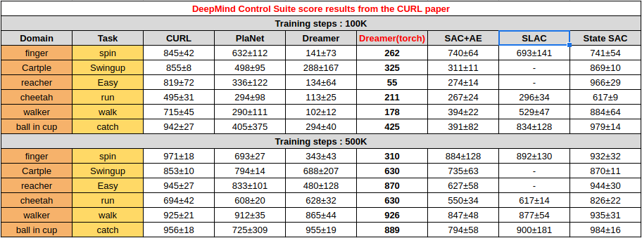
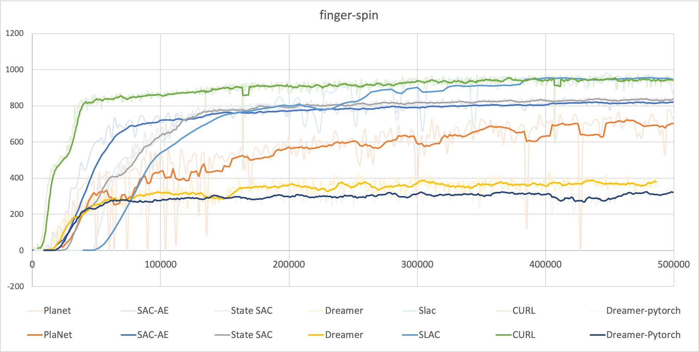
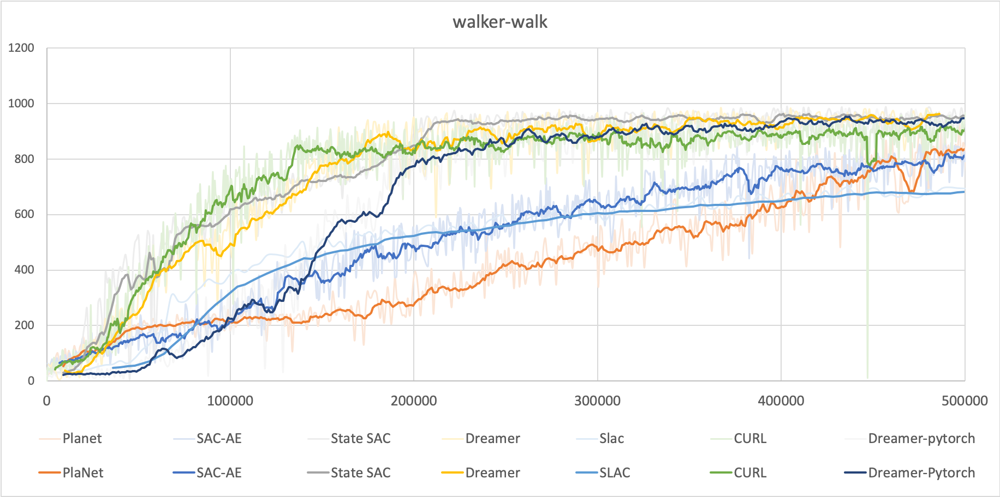
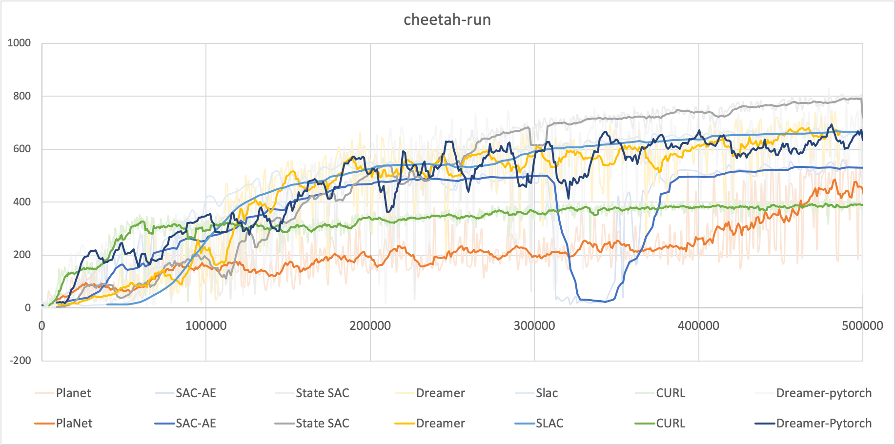
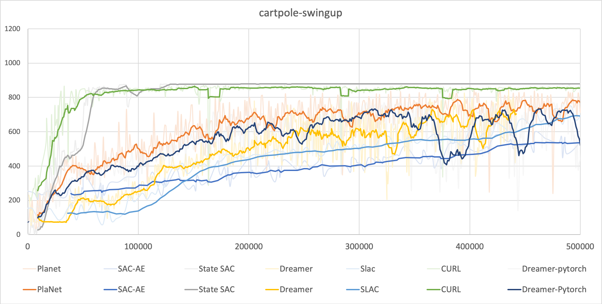
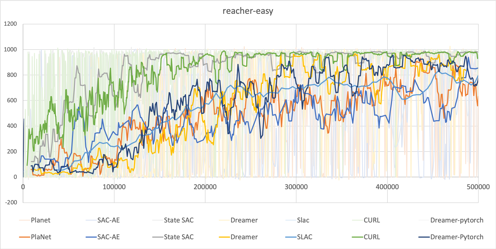
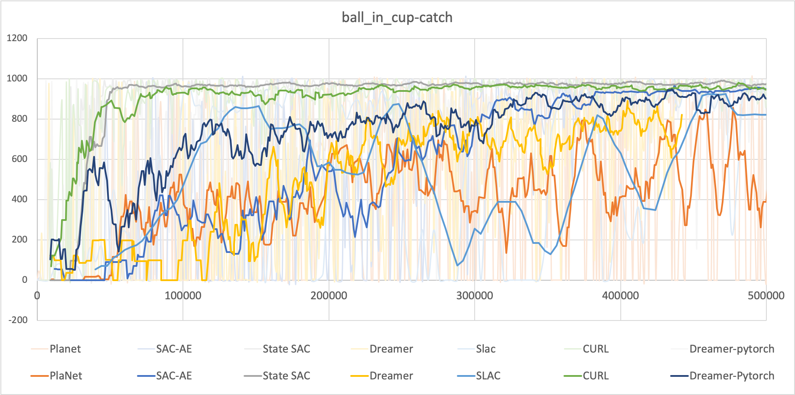

CBF Dreamer implementation in PyTorch
======

## Installation
To install all dependencies with Anaconda run using the following commands. 

`conda create -n CBF-dreamer python==3.8` 

`pip install -r requirements.txt` 

To install the safety_gym library, please visit the following site [here](https://github.com/openai/safety-gym).

## Training (e.g. Safexp-PointGoal1)
To run CBF-dreamer
```bash
python bc.py --algo CBF-dreamer --env Safexp-PointGoal1-v0 --action-repeat 2 --id {name_of_exp}
```

## Testing (e.g. Safexp-PointGoal1)
```bash
python bc.py --algo CBF-dreamer --env Safexp-PointGoal1-v0 --action-repeat 2 --test --render --models {.pth_file_load} --id {name_of_exp}
```

For best performance with DeepMind Control Suite, try setting environment variable `MUJOCO_GL=egl` (see instructions and details [here](https://github.com/deepmind/dm_control#rendering)).

Use Tensorboard to monitor the training.

`tensorboard --logdir results`

<!-- ## Results
The performances are compared with the other SoTA algorithms as follows 
(Note! Tested once using seed 0.)

* [State-SAC](https://github.com/denisyarats/pytorch_sac)
* [PlaNet-PyTorch](https://github.com/Kaixhin/PlaNet)
* [SAC-AE](https://github.com/denisyarats/pytorch_sac_ae)
* [SLAC](https://github.com/ku2482/slac.pytorch)
* [CURL](https://github.com/MishaLaskin/curl)
* [Dreamer (tensorflow2 implementation)](https://github.com/danijar/dreamer)

### NOTE! All the steps below are environment steps. (All the results below are trained 1000 episodes. Each espisode length is 1000 steps. Actual number of sampled data are steps/action_repeat. )

<p align="center">
  
</p>

<p align="center">
  
  
  
  
  
  
</p>

Pretrained models can be found in the [releases](https://github.com/Kaixhin/PlaNet/releases). -->

## Links
- [pytorch implementation of Dreamer](https://github.com/yusukeurakami/dreamer-pytorch)
- [RSSM elaboration](https://arxiv.org/abs/1811.04551)
